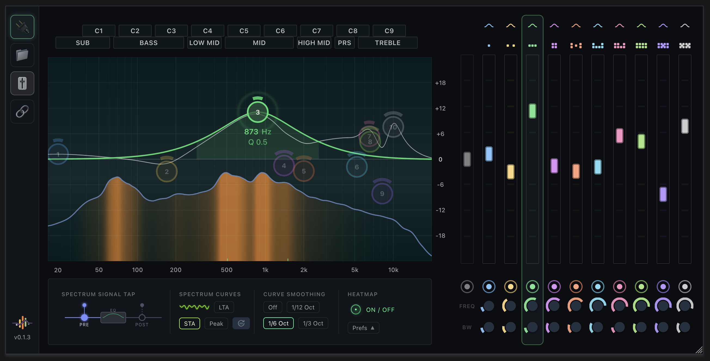
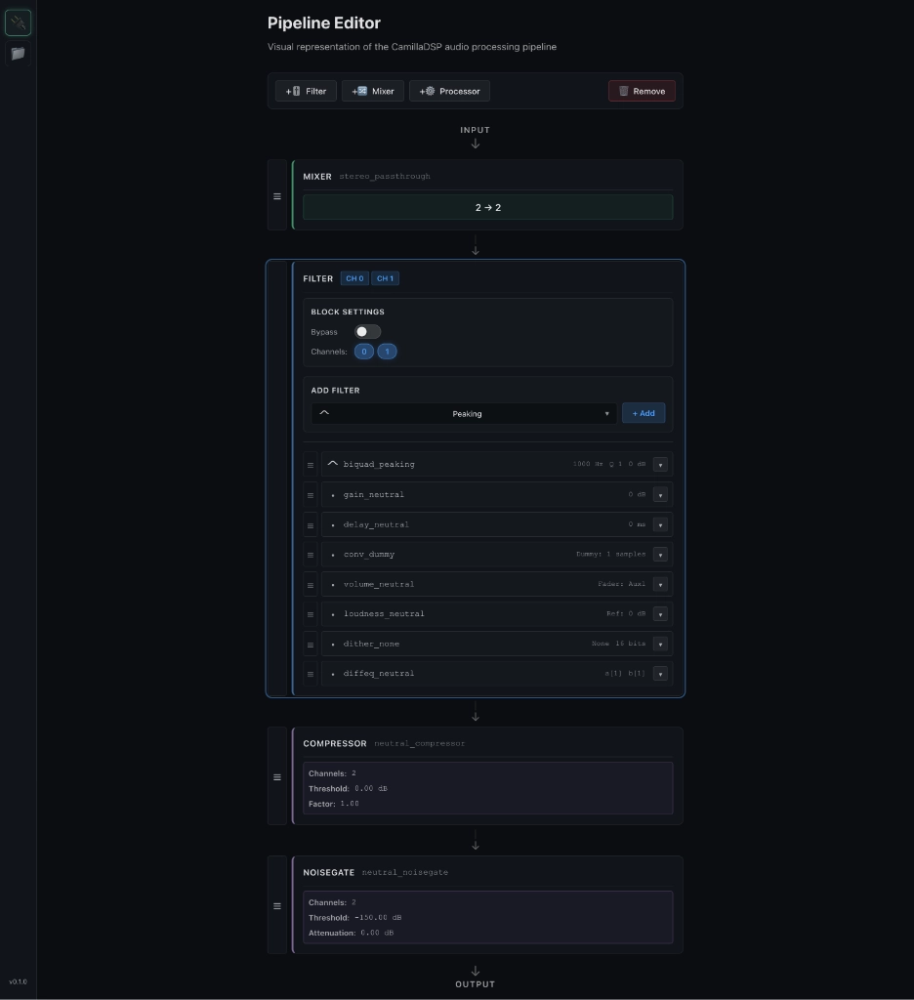
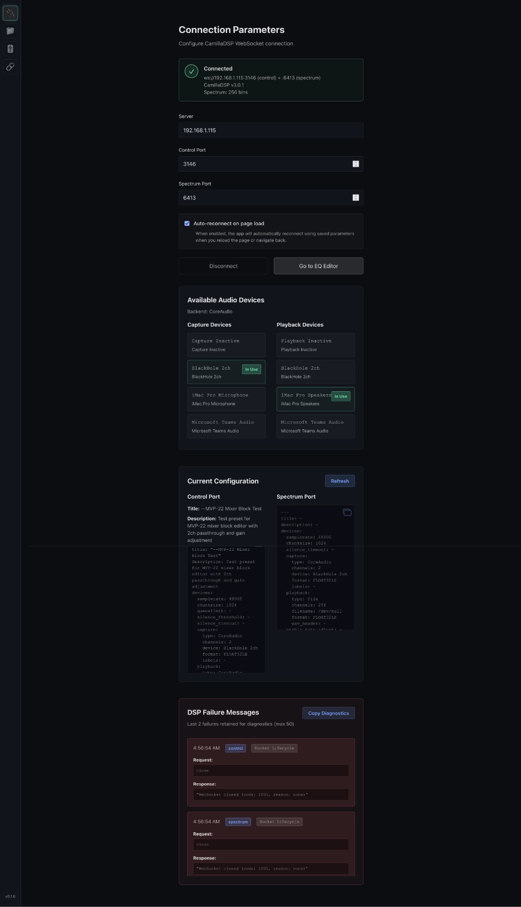

# CamillaEQ  

**A browser-based graphical equalizer and spectrum analyzer for CamillaDSP.**

CamillaEQ is a web UI that gives you direct, visual control over your CamillaDSP audio pipeline. Drag EQ tokens, watch the spectrum respond in real time, and tune your sound with immediate feedback.


---

## What This Is

CamillaEQ is a **browser-based interface** for controlling [CamillaDSP](https://github.com/HEnquist/camilladsp), the powerful audio processing engine. You run it on a small device (like an Orange Pi or Raspberry Pi), and control it entirely from any browser on your network.

It's designed for people who appreciate good UX and want a tool that *feels good to use*. No configuration files, no command-line editing—just drag, adjust, and hear the difference.

---

## Why This Exists

I'm not an audio engineer. I just wanted better sound for my daily work calls.

My laptop doesn't allow installing applications, and I'm on Zoom for hours every day. My microphone and room acoustics weren't great, and I couldn't fix it in software on the laptop itself.

The solution was simple: insert an EQ between the microphone and the laptop. CamillaDSP became the audio engine, running on a tiny Orange Pi Zero 2W. I needed a way to control it—something visual, responsive, and accessible from a browser.

So I built CamillaEQ: a UI focused on clarity, direct manipulation, and immediate feedback.

---

## What Makes It Different

**Visual feedback is everything.**

Most EQ tools show you numbers and sliders. CamillaEQ shows you:
- **Real-time frequency response curves** that update as you drag tokens
- **A spectrum analyzer overlay** behind the EQ curve
- **Bandwidth markers and visual cues** that help you understand what each filter is doing

You're not just editing parameters—you're *seeing* what the audio will sound like.

---

## The Killer Feature: Built-In Spectrum Analyzer

CamillaEQ includes a **real-time spectrum analyzer** that runs at ~10 Hz and displays your audio signal behind the EQ curve.

This isn't a native CamillaDSP feature. It's a clever abuse of CamillaDSP's filter bank capabilities: we generate a log-spaced bandpass filter configuration and read the output levels. It's not perfect, but it provides *immediate visual feedback* while you're tuning.

You can see:
- **Pre-EQ** (what's coming in)
- **Post-EQ** (what's going out)
- **Short-term and long-term averages**
- **Peak hold with decay**

This makes EQ tuning feel **alive**. You adjust a band, and you *see* the spectrum change instantly.

---

## Inspiration

CamillaEQ was inspired by [CamillaNode](https://github.com/ismailAtaman/camillaNode) and the work of its author. CamillaNode proved what was possible with a browser-based CamillaDSP interface.

CamillaEQ takes a different direction—focusing heavily on UX, visual interaction, and direct manipulation—but the inspiration and respect for what came before is real.

---

## Who This Is For

### 🎧 **End Users**
You want to tune your audio and see what's happening. You don't need to understand DSP internals.

**Start here:** [End User Documentation](docs/end-user/)
- [Overview](docs/end-user/overview.md) - What CamillaEQ does
- [Quick Start](docs/end-user/quick-start.md) - Get up and running in 5 minutes
- [Spectrum Analyzer Guide](docs/end-user/spectrum-analyzer.md) - Understanding what you see
- [Troubleshooting](docs/end-user/troubleshooting.md) - When things don't work

---

### 🛠️ **Developers**
You want to understand the architecture, extend functionality, or contribute.

**Start here:** [Developer Documentation](docs/developer/)
- [Architecture Overview](docs/developer/architecture.md) - Module responsibilities and boundaries
- [Runtime Topology](docs/developer/runtime-topology.md) - What runs where, and why
- [Data Flow](docs/developer/data-flow.md) - How config changes propagate
- [Frontend Architecture](docs/developer/frontend.md) - Svelte, Canvas rendering, state management
- [Backend Architecture](docs/developer/backend.md) - Fastify, REST API, persistence
- [State and Persistence](docs/developer/state-and-persistence.md) - State ownership model
- [Extension Points](docs/developer/extension-points.md) - How to add features safely

---

### 🚀 **Power Users / Deployers**
You want to run this on a headless device and make it reliable.

**Start here:** [Power User Documentation](docs/power-user/)
- [Deployment Models](docs/power-user/deployment-models.md) - Dev vs production, network topology
- [Linux Services](docs/power-user/linux-services.md) - systemd installation and management
- [Headless SBC Deployment](docs/power-user/headless-sbc.md) - Orange Pi, Raspberry Pi, resource tuning
- [Recovery and Backups](docs/power-user/recovery-and-backups.md) - Disaster recovery procedures

---

## Try It Now

**Prerequisites:**
- Node.js 18+
- npm 9+
- A running CamillaDSP instance (or use the included mock server)

**Quick start:**

```bash
# Clone the repository
git clone https://github.com/AlfredJKwack/camillaEQ.git
cd camillaEQ

# Install dependencies
npm install

# Start the development server
npm run dev
```

**The UI will be available at `http://localhost:5173`**

### Try Without Real Audio Hardware

You can test the full UI without a real CamillaDSP device using the included **MockCamillaDSP** server:

```bash
# In a separate terminal, start the mock server
npm -w server exec -- tsx -e "import { MockCamillaDSP } from './src/services/mockCamillaDSP'; (async () => { const s = new MockCamillaDSP(); await s.start(); console.log('Mock CamillaDSP running: control=3146 spectrum=6413'); setInterval(() => {}, 1<<30); })().catch(e => { console.error(e); process.exit(1); });"
```

Then in the UI:
1. Navigate to the **Connect** page
2. Set **Server** to `localhost`
3. Set **Control Port** to `3146`
4. Set **Spectrum Port** to `6413`
5. Click **Connect**

You'll see a live spectrum analyzer and be able to adjust EQ bands, even without real audio passing through.

---

## What You Get

- **Interactive EQ editor** with draggable tokens and real-time curve rendering
- **Real-time spectrum analyzer** (pre/post-EQ modes)
- **Pipeline editor** for managing filters, mixers, and processors
- **Preset library** with save/load functionality
- **Direct CamillaDSP integration** via WebSocket (browser connects directly, no proxying)
- **Runs on low-power devices** (Orange Pi, Raspberry Pi, etc.)
- **Fully tested** (240+ tests, 80%+ code coverage)

---

## Project Status

**Current Release:** v0.1.0

CamillaEQ is **production-ready** but still evolving. The core features—EQ editing, spectrum analyzer, preset management, and pipeline editing—are stable and tested.

**What works:**
- ✅ Full CamillaDSP control (config upload, volume, reload)
- ✅ Real-time spectrum analyzer with smoothing and averaging
- ✅ Interactive EQ with 7 filter types (peaking, shelves, HPF/LPF, bandpass, notch)
- ✅ Pipeline editor (reorder filters, edit mixers, add/remove blocks)
- ✅ Preset library with search and keyboard navigation
- ✅ Auto-reconnect with exponential backoff
- ✅ Degraded mode (EQ works even if spectrum socket fails)

**Known limitations:**
- Spectrum analyzer is approximate (bandpass filter bank, not FFT)
- No multi-tab coordination (last-write-wins)
- No authentication (designed for trusted LAN)

---

## Architecture at a Glance

```
┌─────────────────────────────────────────────┐
│  Browser (your laptop, phone, tablet)       │
│                                             │
│  - Loads UI from CamillaEQ server           │
│  - Connects directly to CamillaDSP via WS   │
│  - Stores presets via REST API              │
└─────────────────────────────────────────────┘
         │                    │
         │                    │
    ┌────▼────────┐     ┌─────▼──────────┐
    │ CamillaEQ   │     │  CamillaDSP    │
    │ Server      │     │                │
    │ :3000       │     │  :1234 control │
    │             │     │  :1235 spectrum│
    │ (Node.js)   │     │  (Rust)        │
    └─────────────┘     └────────────────┘
```

**Key design decisions:**
- Browser connects **directly** to CamillaDSP (no WebSocket proxy)
- CamillaEQ server is **not** in the audio path
- Spectrum data flows browser ← CamillaDSP (no server involvement)
- Backend handles presets and recovery cache only

This keeps the audio path clean and allows CamillaEQ to fail without disrupting audio processing.

---

## Technology Stack

**Frontend:**
- Svelte 4 (reactive UI framework)
- TypeScript (type safety)
- Vite (build tool + dev server)
- Canvas API (spectrum rendering)
- SVG (EQ curves and tokens)

**Backend:**
- Node.js 18+
- Fastify (HTTP framework)
- TypeScript (ES modules)

**Testing:**
- Vitest (client tests)
- Jest (server tests)
- 240+ tests total

---

## Contributing

Contributions are welcome. Before opening a PR:

1. Read the [Developer Documentation](docs/developer/)
2. Ensure tests pass: `npm test`
3. Follow the [Extension Points](docs/developer/extension-points.md) guide
4. Keep changes focused and well-tested

---

## License

See [LICENSE](LICENSE) file for details.

---

## Acknowledgements

- **Henrik Enquist** for [CamillaDSP](https://github.com/HEnquist/camilladsp)
- **ismailAtaman** for [CamillaNode](https://github.com/ismailAtaman/camillaNode) (inspiration)
- The RBJ Audio EQ Cookbook (filter math)

---

**Built with care by someone who just wanted better Zoom calls.**

And since a picture is worth a thousand words...

# Demo reel


# Screenshots
## The parametric equalizer


## The pipeline editor


## The connection & diagnostics page

