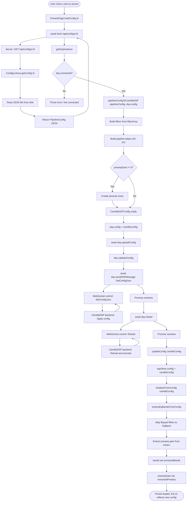

```mermaid
flowchart TD
    Start([App startup or page reload])
    
    Start --> MainTS[main.ts: new App]
    MainTS --> AppMount[App.svelte onMount]
    
    AppMount --> AutoConnect[autoConnectFromLocalStorage]
    AutoConnect --> CheckAuto{localStorage.autoReconnect?}
    CheckAuto -->|false| SkipConnect[Skip auto-connect]
    CheckAuto -->|true| ReadParams[Read server/controlPort/spectrumPort from localStorage]
    
    ReadParams --> CallConnect[await connect server, ports]
    CallConnect --> CreateDsp{dspInstance exists?}
    CreateDsp -->|No| NewDsp[dspInstance = new CamillaDSP]
    CreateDsp -->|Yes| DisconnectOld[dspInstance.disconnect]
    DisconnectOld --> NewDsp
    
    NewDsp --> ConnectControl[await connectToDSP server, controlPort]
    ConnectControl --> WSControl[WebSocket connection to control port]
    WSControl --> ResolveControl[Promise resolves: ws connected]
    
    ResolveControl --> ConnectSpectrum[await connectToDSP server, spectrumPort]
    ConnectSpectrum --> WSSpectrum[WebSocket connection to spectrum port]
    WSSpectrum --> ResolveSpectrum[Promise resolves optional]
    
    ResolveSpectrum --> InitAfterConn[initAfterConnection]
    InitAfterConn --> DownloadConfig[await downloadConfig]
    DownloadConfig --> SendGetConfig[await sendDSPMessage GetConfigJson]
    SendGetConfig --> WSGetConfig[WebSocket: GetConfigJson]
    WSGetConfig --> CamillaDSP[CamillaDSP backend returns config]
    CamillaDSP --> WSGetConfig
    SendGetConfig --> ParseConfig[Parse JSON response]
    ParseConfig --> AssignConfig1[dsp.config = parsed config]
    
    AssignConfig1 --> GetDefaultConfig[getDefaultConfig normalize]
    GetDefaultConfig --> CheckEmpty{filters/pipeline empty?}
    
    CheckEmpty -->|No| SetConnected1[dspState.connectionState = connected]
    CheckEmpty -->|Yes| MaybeRestore[maybeRestoreLatestState]
    
    MaybeRestore --> FetchLatest[await fetch /api/state/latest]
    FetchLatest --> Server2[Server: GET /api/state/latest]
    Server2 --> StateRead[ConfigStore.readConfig latest_dsp_state.json]
    StateRead --> ReturnLatest[Return CamillaDSPConfig]
    ReturnLatest --> FetchLatest
    
    FetchLatest --> AssignLatest[dsp.config = latestConfig]
    AssignLatest --> UploadLatest[await dsp.uploadConfig]
    UploadLatest --> SetConfigLatest[WebSocket: SetConfigJson]
    SetConfigLatest --> ReloadLatest[WebSocket: Reload]
    ReloadLatest --> UpdateDspStore1[updateConfig latestConfig]
    UpdateDspStore1 --> InitEqFromLatest[initializeFromConfig latestConfig]
    InitEqFromLatest --> SetConnected1
    
    SetConnected1 --> RefreshVol[await refreshVolume]
    RefreshVol --> SendGetVol[WebSocket: GetVolume]
    SendGetVol --> UpdateVolStore[dspState.volumeDb = value]
    
    UpdateVolStore --> RouterCheck[router.ts: getCurrentRoute]
    RouterCheck --> CheckHash{window.location.hash?}
    CheckHash -->|None| CheckLocalStorage{localStorage has server?}
    CheckLocalStorage -->|Yes| RouteEQ[Route to /eq]
    CheckLocalStorage -->|No| RouteConnect[Route to /connect]
    CheckHash -->|/eq| RouteEQ
    
    RouteEQ --> EqPageMount[EqPage.svelte renders]
    EqPageMount --> EqReactive[Reactive block watches dspStore]
    EqReactive --> CheckInit{eqInitialized && connected && config?}
    CheckInit -->|No| WaitReactive[Wait for connection]
    CheckInit -->|Yes| InitEqUI[initializeFromConfig dspConfig]
    
    InitEqUI --> ExtractEq[extractEqBandsFromConfig]
    ExtractEq --> MapBands[Map filters to EqBand]
    MapBands --> UpdateBands[bands.set + preampGain.set]
    UpdateBands --> RenderUI[EqPage renders bands, plot, faders]
    
    RenderUI --> Complete([EQ page ready for interaction])
    SkipConnect --> RouteCheck2[router.ts: getCurrentRoute]
    RouteCheck2 --> CheckHash
```

```mermaid
flowchart TD
    Start([User interacts with EQ control])
    
    Start --> UIEvent{Which control?}
    
    UIEvent -->|Token drag XY| TokenMove[handleTokenPointerMove]
    UIEvent -->|Token drag Shift+Y| TokenMoveQ[handleTokenPointerMove shift]
    UIEvent -->|Token wheel| TokenWheel[handleTokenWheel]
    UIEvent -->|Knob freq/Q| KnobChange[KnobDial on:change]
    UIEvent -->|Fader gain| FaderMove[handleFaderPointerDown]
    UIEvent -->|Mute button| MuteClick[toggleBandEnabled]
    UIEvent -->|Master fader| MasterFader[handleMasterFaderPointerDown]
    
    TokenMove --> SetFreqGain[setBandFreq + setBandGain]
    TokenMoveQ --> SetQ1[setBandQ]
    TokenWheel --> SetQ2[setBandQ]
    KnobChange --> KnobAction{Which knob?}
    KnobAction -->|Freq| SetFreq[setBandFreq]
    KnobAction -->|Q| SetQ3[setBandQ]
    FaderMove --> SetGain[setBandGain]
    MuteClick --> ToggleEnabled[toggleBandEnabled]
    MasterFader --> SetPreamp[setPreampGain]
    
    SetFreqGain --> UpdateStore1[bands.update clamp + round]
    SetQ1 --> UpdateStore1
    SetQ2 --> UpdateStore1
    SetQ3 --> UpdateStore1
    SetFreq --> UpdateStore1
    SetGain --> UpdateStore1
    ToggleEnabled --> UpdateStore1
    SetPreamp --> UpdatePreampStore[preampGain.set clamp]
    
    UpdateStore1 --> TriggerDebounce1[debouncedUpload.call]
    UpdatePreampStore --> TriggerDebounce1
    
    TriggerDebounce1 --> CheckTimer{Timer active?}
    CheckTimer -->|Yes| ResetTimer[Clear + restart 200ms timer]
    CheckTimer -->|No| StartTimer[Start 200ms timer]
    
    ResetTimer --> WaitMoreInput[Wait for user to finish editing...]
    StartTimer --> WaitMoreInput
    WaitMoreInput --> TimerFires{200ms elapses?}
    TimerFires -->|More edits| ResetTimer
    TimerFires -->|No more edits| ExecuteUpload[debouncedUpload async function runs]
    
    ExecuteUpload --> GetDspInst[getDspInstance]
    GetDspInst --> GetCurrentBands[get bands store]
    GetCurrentBands --> GetCurrentPreamp[get preampGain store]
    
    GetCurrentPreamp --> ApplyBands[applyEqBandsToConfig lastConfig, updatedData]
    ApplyBands --> UpdateFilters[Update filter parameters in config.filters]
    UpdateFilters --> UpdatePreampMixer{preampGain != 0?}
    UpdatePreampMixer -->|Yes| CreateMixer[Create/update preamp mixer]
    UpdatePreampMixer -->|No| KeepMixer[Keep existing mixer structure]
    CreateMixer --> UpdatedConfig[updatedConfig ready]
    KeepMixer --> UpdatedConfig
    
    UpdatedConfig --> AssignToDsp[dsp.config = updatedConfig]
    AssignToDsp --> SetPending[uploadStatus.set pending]
    SetPending --> CallUpload[await dsp.uploadConfig]
    
    CallUpload --> ValidateConfig2[dsp.validateConfig]
    ValidateConfig2 --> SendSet[await sendDSPMessage SetConfigJson]
    SendSet --> WSSet[WebSocket control: SetConfigJson]
    WSSet --> CamillaDSP3[CamillaDSP backend: Update config]
    CamillaDSP3 --> WSSet
    SendSet --> ResolveSet2[Promise resolves]
    
    ResolveSet2 --> SendReload2[await sendDSPMessage Reload]
    SendReload2 --> WSReload[WebSocket control: Reload]
    WSReload --> CamillaDSP4[CamillaDSP backend: Apply and activate]
    CamillaDSP4 --> WSReload
    SendReload2 --> ResolveReload2[Promise resolves]
    
    ResolveReload2 --> UpdateSuccess{Upload success?}
    UpdateSuccess -->|Yes| StoreConfig[lastConfig = updatedConfig]
    UpdateSuccess -->|No| SetError[uploadStatus.set error]
    
    StoreConfig --> UpdateDspStore2[updateDspConfig updatedConfig]
    UpdateDspStore2 --> PersistState[fetch PUT /api/state/latest]
    
    PersistState --> Server3[Server: PUT /api/state/latest]
    Server3 --> StateWrite[ConfigStore.writeConfig latest_dsp_state.json]
    StateWrite --> NonFatal{Persist success?}
    NonFatal -->|No| LogWarn[console.warn, continue]
    NonFatal -->|Yes| PersistDone[State persisted]
    
    LogWarn --> SetSuccess[uploadStatus.set success]
    PersistDone --> SetSuccess
    SetSuccess --> ScheduleReset[setTimeout 2s]
    ScheduleReset --> ResetIdle[uploadStatus.set idle]
    
    SetError --> UserRetry[User sees error state]
    ResetIdle --> Complete([Changes applied, UI shows success])
    
    UserRetry --> RetryOrManual[User can retry or manually reconnect]
```

# CamillaEQ Flow Charts

This document outlines the key flows in the CamillaEQ application with detailed Mermaid diagrams showing function calls, class methods, promise resolutions, and server interactions.

---

## 1. Preset Load Flow

### Diagram

### Explanation

**Flow Overview:**
When a user clicks the "Load" button on a preset in the PresetsPage, the application executes a complete configuration swap:

1. **Fetch from Server** (`PresetsPage.loadConfig`):
   - Makes HTTP GET request to `/api/configs/:id`
   - Server's `ConfigsLibrary.getConfig()` reads the PipelineConfig JSON from disk
   - Returns the simplified preset format containing configName, filterArray, and optional accessKey

2. **Convert Format** (`pipelineConfigToCamillaDSP`):
   - Takes the PipelineConfig and converts it to the full CamillaDSP format
   - Builds filters dictionary from filterArray (Filter01, Filter02, etc.)
   - Creates pipeline steps for channels 0 and 1
   - Adds preamp mixer if preampGain is non-zero

3. **Upload to CamillaDSP** (`dsp.uploadConfig`):
   - Validates the config structure (checks mixer/filter references)
   - Sends `SetConfigJson` command via WebSocket to CamillaDSP backend
   - Waits for confirmation, then sends `Reload` command to activate
   - Both operations are async and await promise resolution

4. **Update Application State**:
   - Updates `dspStore.config` with the new configuration
   - Calls `initializeFromConfig` in eqStore to populate band parameters
   - `extractEqBandsFromConfig` maps CamillaDSP Biquad filters to EqBand objects
   - Updates reactive Svelte stores (`bands`, `preampGain`)
   - EQ UI automatically reflects the new preset through store subscriptions

**Key Promise Points:**
- `fetch('/api/configs/:id')` - HTTP request
- `dsp.sendDSPMessage({SetConfigJson: ...})` - WebSocket command
- `dsp.reload()` - WebSocket Reload command

---

## 2. EQ Page Load/Reload Flow

### Diagram

### Explanation

**Flow Overview:**
When the application starts or the page is reloaded, multiple systems initialize in sequence:

1. **Application Bootstrap**:
   - `main.ts` creates the Svelte App instance
   - `App.svelte` calls `autoConnectFromLocalStorage()` in its `onMount` hook
   - Router determines initial route based on hash or localStorage presence

2. **Auto-Connect Sequence** (if enabled):
   - Checks `localStorage.camillaDSP.autoReconnect` flag
   - Reads connection parameters (server, controlPort, spectrumPort)
   - Calls `connect()` which creates/reuses the global `CamillaDSP` instance
   - Opens two WebSocket connections: control (commands) and spectrum (audio data)

3. **Configuration Download**:
   - After connection, calls `downloadConfig()` to fetch current CamillaDSP state
   - Sends `GetConfigJson` command via WebSocket
   - Normalizes response with `getDefaultConfig()` (fills required fields)

4. **Empty Config Recovery** (if needed):
   - If downloaded config has no filters/pipeline, triggers `maybeRestoreLatestState()`
   - Fetches `/api/state/latest` from server (last known good config)
   - Uploads restored config back to CamillaDSP via `SetConfigJson` + `Reload`
   - This ensures the DSP always has a working configuration

5. **Routing and Page Load**:
   - Router checks `window.location.hash` or localStorage to determine route
   - If connected and hash is empty/root, defaults to `/eq`
   - EqPage component mounts and starts rendering

6. **EQ Page Initialization**:
   - Reactive block watches `dspStore` for connection + config availability
   - Once both are ready, calls `initializeFromConfig()`
   - Extracts EQ bands from CamillaDSP config via `extractEqBandsFromConfig()`
   - Maps Biquad filter definitions to `EqBand` objects
   - Updates reactive stores (`bands`, `preampGain`)
   - UI renders automatically through Svelte reactivity

**Key Promise Points:**
- `connectToDSP()` - Two WebSocket connections (control + spectrum)
- `sendDSPMessage('GetConfigJson')` - Config download
- `fetch('/api/state/latest')` - State restoration
- `dsp.uploadConfig()` - SetConfigJson + Reload (if restoring)
- `dsp.getVolume()` - Initial volume fetch

**Fallback Behavior:**
If auto-reconnect is disabled or connection fails, the app routes to `/connect` page where user can manually configure connection parameters.

---

## 3. EQ Token/Band Edit Flow

### Diagram

### Explanation

**Flow Overview:**
User interactions with EQ controls trigger a debounced upload pipeline that batches rapid changes and uploads to CamillaDSP:

1. **UI Event Handlers**:
   Multiple input methods map to eqStore actions:
   - **Token drag (normal)**: X-axis → frequency, Y-axis → gain
   - **Token drag (Shift)**: Y-axis only → Q factor
   - **Token wheel**: Scroll → Q factor adjustment
   - **Knob dials**: Rotate → frequency or Q
   - **Faders**: Vertical drag → gain
   - **Mute button**: Click → toggle enabled state
   - **Master fader**: Vertical drag → preamp gain

2. **Store Updates** (`eqStore`):
   - Each action calls a store mutation function (e.g., `setBandFreq`, `setBandGain`, `setBandQ`)
   - Values are clamped and rounded to valid ranges:
     - Frequency: 20-20000 Hz (integer)
     - Gain: -24 to +24 dB (1 decimal)
     - Q: 0.1-10 (1 decimal)
   - Svelte store updates trigger reactive UI updates immediately (optimistic)

3. **Debounced Upload** (`debounceCancelable`):
   - Each mutation calls `debouncedUpload.call()`
   - If timer is active, it's cleared and restarted (200ms)
   - This batches rapid edits (e.g., dragging a token) into a single upload
   - After 200ms of inactivity, the async upload function executes

4. **Configuration Update** (`applyEqBandsToConfig`):
   - Reads current band state from stores
   - Applies changes to the last known CamillaDSP config
   - Updates filter parameters (freq, gain, q, bypassed)
   - Creates/updates preamp mixer if preampGain is non-zero
   - Preserves all other config sections (devices, non-EQ filters, etc.)

5. **Upload to CamillaDSP** (`dsp.uploadConfig`):
   - Sets upload status to "pending" (shows in UI)
   - Validates config structure
   - Sends `SetConfigJson` via WebSocket (updates DSP config)
   - Sends `Reload` via WebSocket (activates new config)
   - Both commands await promise resolution

6. **Success Handling**:
   - Stores updated config as new baseline (`lastConfig`)
   - Updates global `dspStore.config` for consistency
   - Attempts to persist to server (`PUT /api/state/latest`) - non-fatal if fails
   - Sets upload status to "success" for 2 seconds, then returns to "idle"

7. **Error Handling**:
   - On upload failure, sets status to "error" with message
   - User can retry by making another edit
   - Connection remains active; subsequent edits will retry upload

**Key Promise Points:**
- `sendDSPMessage({SetConfigJson: ...})` - WebSocket config update
- `sendDSPMessage('Reload')` - WebSocket activation
- `fetch('PUT /api/state/latest')` - Best-effort persistence (non-blocking)

**Debounce Behavior:**
The 200ms debounce provides:
- Smooth dragging without flooding WebSocket with commands
- Batched updates for multiple simultaneous changes
- Reduced DSP reload cycles (each Reload briefly interrupts audio)

**State Persistence:**
After successful upload, the app writes to `/api/state/latest` so that on next load, if CamillaDSP returns an empty config, the last working state can be restored. This persistence is best-effort (continues on failure).

---

## Summary

These three flows represent the core interaction patterns in CamillaEQ:

1. **Preset Load**: User-initiated complete config replacement from saved presets
2. **EQ Page Load**: Automatic connection and state restoration on app startup
3. **Live Editing**: Real-time parameter adjustments with debounced DSP updates

All flows use:
- **WebSocket** for CamillaDSP communication (control + spectrum)
- **HTTP REST API** for preset/state persistence
- **Svelte stores** for reactive state management
- **Promise-based async/await** for all I/O operations
- **Debouncing** for performance optimization (editing only)

The architecture maintains a clear separation between:
- UI layer (Svelte components)
- State management (stores)
- Business logic (mapping/validation)
- I/O layer (CamillaDSP client, HTTP)
